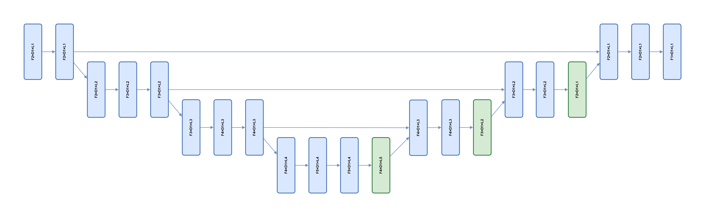

### HLTM Scheme Redactor — визуализация и редактирование схем PyTorch-моделей (обёртка над TorchView)

Этот проект предоставляет два компонента, работающих вместе:

- **Ноутбук `TVWrapper.ipynb`**: строит вычислительный граф вашей PyTorch‑модели с помощью TorchView и экспортирует его в самодостаточный HTML на базе Cytoscape.
- **Веб‑редактор (`index.html`, `script.js`, `style.css`)**: открывает сгенерированный HTML, позволяет визуально редактировать схему (оформление, геометрию, удаления узлов/рёбер) и сохранять результат как HTML или PNG.

Основано на библиотеке TorchView. Репозиторий TorchView: [github.com/mert-kurttutan/torchview](https://github.com/mert-kurttutan/torchview).


### Содержание

- Важно (2 шага)
- Требования
- Установка
- Структура проекта
- Как это работает
- Экспорт архитектуры в HTML (через ноутбук)
- Редактирование схемы (в веб‑редакторе)
- Поддерживаемые параметры стиля и горячие клавиши
- Формат входного HTML для редактора
- FAQ / Решение проблем
- Благодарности и лицензии


### Важно (2 шага)

1) Решение основано на TorchView и представляет собой обёртку из двух компонентов: ноутбука для экстракции архитектуры в HTML‑формат и страницы для редактирования полученного файла ([источник TorchView](https://github.com/mert-kurttutan/torchview)).

2) Чтобы получить HTML своей архитектуры, откройте `TVWrapper.ipynb`, добавьте модель в ячейку «Model», настройте параметры в ячейке «Produce HTML» и запустите ноутбук; затем используйте веб‑редактор для дооформления и экспорта.


### Требования

- Python 3.8+
- PyTorch (версия совместимая с TorchView, ≥1.7)
- TorchView и Graphviz (для TorchView требуется установленная утилита `dot`)
- Jupyter Notebook / JupyterLab / Google Colab
- Современный браузер (Chrome/Firefox/Edge) для редактора


### Установка

Установите зависимости Python:

```bash
pip install torchview graphviz
```

Убедитесь, что системная утилита Graphviz установлена и доступна (нужна для работы TorchView):

- Windows: скачайте Graphviz с сайта проекта и добавьте `dot.exe` в PATH, либо используйте пакетный менеджер (например, `choco install graphviz`).
- Linux/macOS: установите систему пакетами (`apt install graphviz`, `brew install graphviz` и т.д.).

Google Colab: в `TVWrapper.ipynb` уже есть ячейка «Required Installs» с:

```python
! pip install -q torchview
! pip install -q -U graphviz
```


### Структура проекта

- `TVWrapper.ipynb` — ноутбук‑обёртка для TorchView. Создаёт Cytoscape‑совместимый HTML с вашей моделью.
- `index.html` — страница редактора схем (загрузка HTML, элементы управления, контейнер графа).
- `script.js` — логика редактора: парсинг HTML, рендер в Cytoscape, редактирование узлов/рёбер, экспорт.
- `style.css` — оформление панели управления и области рендеринга.


### Как это работает

Пайплайн состоит из двух фаз:

1) В ноутбуке TorchView строит вычислительный граф вашей модели (модули, функции, тензоры), затем вспомогательные функции конвертируют его в JSON‑структуру для Cytoscape и встраивают в HTML. Результат — файл вида `unet_graph.html` с кодом `cytoscape({ elements, layout, style })`.

2) В веб‑редакторе вы загружаете этот HTML. Скрипт извлекает конфигурацию Cytoscape из файла, рендерит граф, даёт инструменты редактирования (стили, удаление, сетка, снап‑к‑сетке), и позволяет сохранить:
   - как HTML — с «preset»‑разметкой (фиксированные координаты),
   - как PNG — с белой рамкой (для вставки в документы/отчёты).


### Экспорт архитектуры в HTML (через ноутбук)

1. Откройте `TVWrapper.ipynb`.

2. Выполните ячейку «Required Installs» (в Colab это обязательный шаг).

3. В ячейке «Model» опишите вашу модель PyTorch или импортируйте её. В примере дан U‑Net на 1D‑сигналах. Замените класс/импорт своим.

4. В ячейке «Produce HTML» настройте ключевые параметры вызова `torchview.draw_graph(...)`:
   - `input_size` — форма входа (под вашу модель);
   - `expand_nested=True` — разворачивать вложенные модули;
   - `show_shapes=True` — показывать формы тензоров;
   - `depth` — глубина вложенности в визуализации;
   - `roll=True` — сворачивать/сворачиваемые повторяющиеся блоки;
   - `hide_inner_tensors=False` — важно: оставить внутренние тензоры, чтобы корректно извлечь размеры для подписей;
   - дополнительные стили узлов через словарь `STYLE` (цвет фона/рамки, класс и т.п.).

   В ноутбуке есть утилиты:
   - `build_cytoscape(...)` — сборка JSON для Cytoscape (фильтрация скрытых тензоров, построение рёбер, формирование подписей);
   - `show_cy(...)` — генерация HTML‑вставки с Cytoscape и `dagre`‑раскладкой (на этапе предпросмотра).

5. Выполните ячейку «Produce HTML». В выводе отобразится интерактивная схема. Затем сохраните HTML:
   - В Colab выполните ячейку «Save as File» — будет создан и скачан, например, `unet_graph.html`.
   - В JupyterLab можно записать строку `html` в файл вручную (ячейка уже показывает пример с `open(..., 'w')`).

Итоговый файл должен содержать вызов `cytoscape({...})` с полями `elements`, `layout`, `style` — это важно для корректной загрузки в редактор.


### Редактирование схемы (в веб‑редакторе)

1. Откройте локально `index.html` (двойной клик или через встроенный сервер). Интернет не обязателен — скрипты берутся с CDN, но страница работает оффлайн после загрузки.

2. В панели слева нажмите «Загрузить HTML‑схему» и выберите файл, сгенерированный ноутбуком (например, `unet_graph.html`).

3. После загрузки появится панель редактирования:
   - «Показать сетку» — фон‑сетка для выравнивания;
   - «Редактировать элемент» — выпадающий список селекторов стиля Cytoscape;
   - динамические поля для изменения свойств выбранного селектора;
   - кнопки «Сохранить как HTML», «Сохранить как PNG», «Удалить выбранный».

4. Редактирование узлов/рёбер:
   - Клик по узлу/ребру: элемент подсвечивается, а в списке стилей автоматически создаётся индивидуальное правило (`node#<id>` или `edge#<id>`) с текущими значениями — удобно точечно настраивать.
   - Поля стилей изменяют визуальный вид мгновенно.
   - Можно добавить новый селектор («+ Добавить новый селектор») и оформить целые классы элементов.

5. Перемещение и выравнивание:
   - Перетаскивайте узлы мышью.
   - Удерживайте Shift во время перетаскивания, чтобы узлы прилипали к сетке (снап к шагу 25px).
   - Колёсиком мыши — масштаб; средняя кнопка (клик колёсиком) — быстрое «fit to screen».

6. Удаление:
   - «Удалить выбранный» удаляет активный узел или ребро.
   - При удалении узла редактор автоматически соединяет всех его родителей со всеми потомками (избегая петель и дубликатов рёбер).

7. Экспорт:
   - «Сохранить как HTML» — сохраняет автономный HTML с макетом `preset` (фиксированные координаты сохранятся 1:1).
   - «Сохранить как PNG» — экспорт на белом фоне с дополнительной рамкой по краям (удобно для документов).


### Поддерживаемые параметры стиля и горячие клавиши

- Узлы (`node`):
  - background-color, border-color, border-width
  - shape (rectangle, round-rectangle, ellipse, triangle, pentagon, hexagon, heptagon, octagon, star, barrel, diamond, vee, rhomboid, polygon)
  - width, height (число или, например, `data(w)`)
  - font-size, font-weight (normal | bold)
  - label

- Рёбра (`edge`):
  - line-color, line-style (solid | dashed | dotted)
  - width, curve-style (bezier | straight | haystack | unbundled-bezier)
  - target-arrow-shape (none | triangle | vee | tee | square | circle | diamond | ...)
  - target-arrow-color

- Горячие действия:
  - Shift при перетаскивании узла — прилипание к сетке.
  - Средняя кнопка мыши в области графа — моментальное выравнивание (fit).


### Формат входного HTML для редактора

Редактор ожидает внутри HTML выражение вида:

```html
<script>
  cytoscape({
    container: ...,            // может быть игнорирован при разборе
    elements: { nodes: [...], edges: [...] },
    layout:   { name: 'dagre' | 'preset' | ... },
    style:    [ { selector: 'node', style: { ... } }, ... ]
  });
</script>
```

Парсер извлекает объект внутри `cytoscape( { ... } )`. Если структура другая, появится сообщение «Конфигурация Cytoscape не найдена».


### FAQ / Решение проблем

- TorchView требует установленный Graphviz (`dot`). Убедитесь, что `dot` доступен в PATH. См. рекомендации в репозитории TorchView: [github.com/mert-kurttutan/torchview](https://github.com/mert-kurttutan/torchview).

- Слишком большая модель/память: в TorchView можно использовать `device='meta'` (для новых версий PyTorch), чтобы оценить граф без выделения памяти под тензоры.

- Не отображаются формы тензоров: проверьте, что в ноутбуке `show_shapes=True` и `hide_inner_tensors=False` — эти параметры критичны для извлечения размеров при формировании подписей.

- Редактор не открывает файл: файл должен содержать вызов `cytoscape({...})`. Загружайте именно HTML, сгенерированный ячейками ноутбука `Produce HTML`/`Save as File`.

- PNG обрезается при вставке: редактор экспортирует изображение с дополнительной белой рамкой. Если нужно больше поля, измените величину рамки в `script.js` (переменная `PAD`).


### Благодарности и лицензии

- Проект основан на TorchView — «visualize PyTorch models»: [github.com/mert-kurttutan/torchview](https://github.com/mert-kurttutan/torchview). Лицензия TorchView: MIT.
- Движок визуализации в редакторе — [Cytoscape.js](https://js.cytoscape.org/); раскладка — `dagre`.


